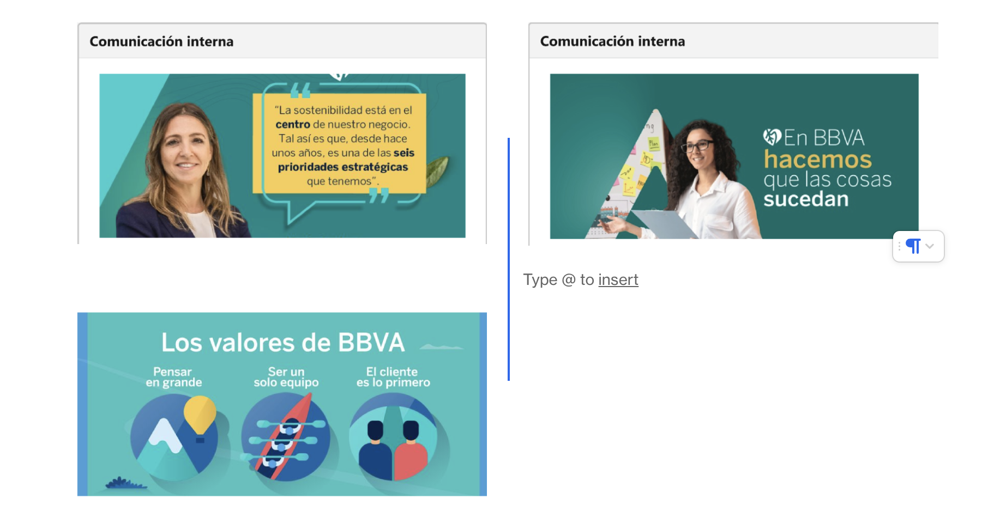

<div>
	
</div>

# _[SE Assist 105360](https://org62.lightning.force.com/lightning/r/SSE_Assist__c/a303y000000qoc4AAA/view)_

#### Customer: _BBVA México_

#### Sub-title about your assist goes here with any relevant <a href="https://developer.salesforce.com/">links...</a>

<h4 align="center">
	<a href="https://salesforce.quip.com/wBOSA8FdJlfn">Quip with Info</a> 
</h4>

<p align="center">
	
</p>

---

## Features

This is a Hardcoded Panel component to simulate within a V360 of a customer, or within the Home page of an App, the communications that an HR department might want to spread within their company.

## Getting Started

In order to install this component, download the source code and open it with Visual Studio Code. Authenticate your org with Visual Studio Code by doing CMD + SHIFT + P and writing "Authorize an Org", and once authenticated right click on the LWC folder within your folder tree and click the option "Deploy This Source to Org"

### Prerequisites

This works in either SDOs or IDOs. Already tested in the FINS IDO of May 2024.

### Install

_Add installation instructions here._

_Below is an example of what that might look like._

Deploy the source:

1. Clone this repository:

```
git clone git@github.com:gdedios/SEAssist105360.git
cd SEAssist105360
```

2. Authorize with your org and provide it with an alias (OrgAlias):

```
sfdx force:auth:web:login -a "OrgAlias"
```

3. Push the app to your org:

```
sfdx force:source:deploy --sourcepath force-app/main/default --json --loglevel fatal --targetusername "OrgAlias"
```

4. Open the default org:

```
sfdx force:org:open --targetusername "OrgAlias"
```

## Usage

Go to your Home Page and click on Edit Page within the Gear of Settings on the top right of the Salesforce Lightning UI. Within the Page Builder, drag and drop the component named gDD_CommunicationHomePannel to the place within the page that you'd like.

To change the Images hardcoded in the component, you need to go to visual studio code, go to the lwc folder -> gDD_CommunicationHomePanel.html and modify the links within the src variable of each lightning-carousel-image holder. Eg.: src="https://i.ibb.co/yp3bMH6/image-1.png".

## FAQs

Any problem, contact me over slack: Gonzalo de Dios

#### Does it work in Communities?

> No

#### Does it work in Mobile?

> Yes
